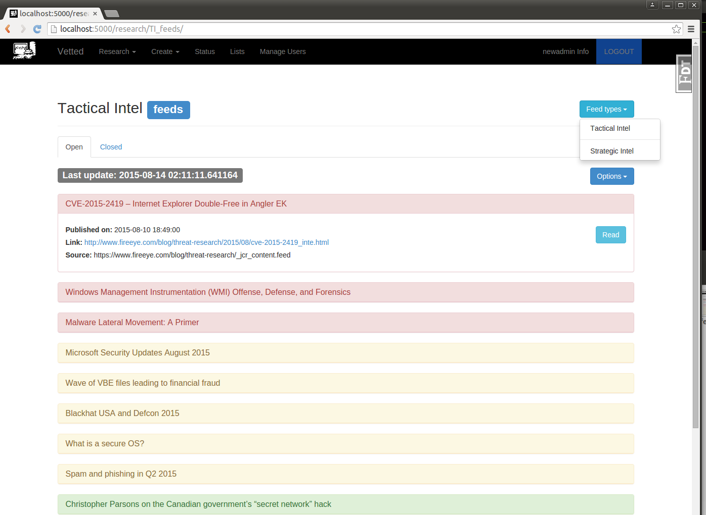

# Vetted

Currently being developed on ubuntu 14.04 using postgres 9.4 and flask.

### Overview

The idea behind this project is to create a simple indicator management app that is able to provide security analysts with a workflow to easily research, create, contextualize, and store threat detections. Once those detections have been vetted, they are available via api in the below json format, which could then be pulled down to a detection device for consumption. For more info check out the documentation.html page found in the welcome template dir.  

### JSON format

```
{
  "created_date": "", 
  "indicators": [
    {
    ""
    }, 
  ],
  "notes": "",
  "priority": "", 
  "source": "", 
  "tags": [
    ""
  ],
  "type_hash": ""
}
```

### Detection types

Supported detection types: 'Bro Intel', 'Snort', 'Yara'.

### API clients

Bro Intel, Snort. (Both tested and working on Security Onion)

### Installing

Getting this spun up is a manual process. For more info check out the INSTALL doc.

### Misc

- Auto converts pdfs, and cleans docx and html file types before scraping atomic indicators from those sources for the Bro Intel detection type. Also scrapes keywords, which are added as tags to the associated detection object(s).

- research module has an rss and atom feed parser. 

- RBAC: admin, user

### Screenshots





### To do:
- add "memory - yara" detection object
- yara bin/mem api client
- more research modules
- task queue
- easy install script


Feel free to contact me if you have any questions or feedback.

reed3276@gmail.com

@reed1713